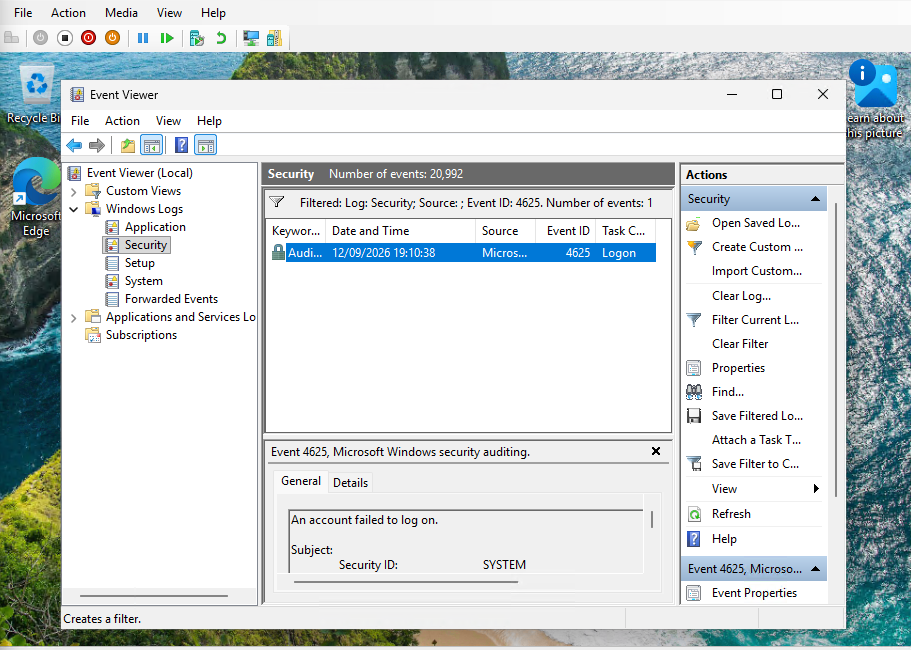
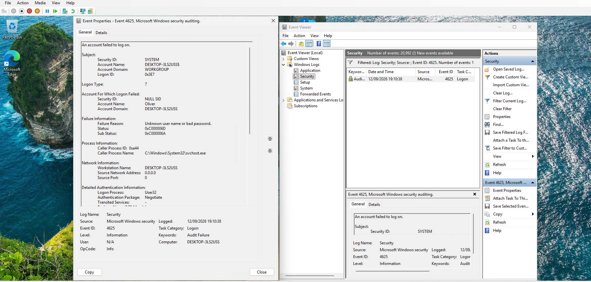
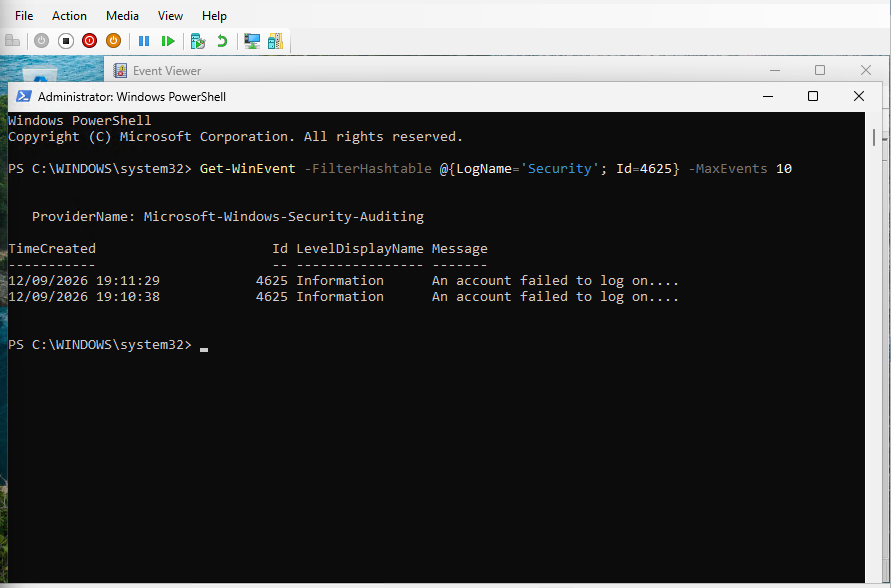
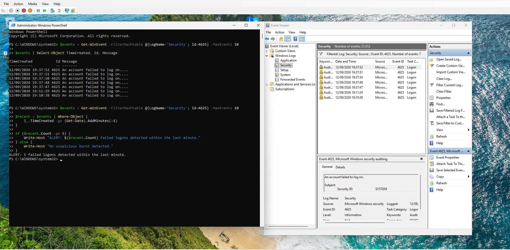
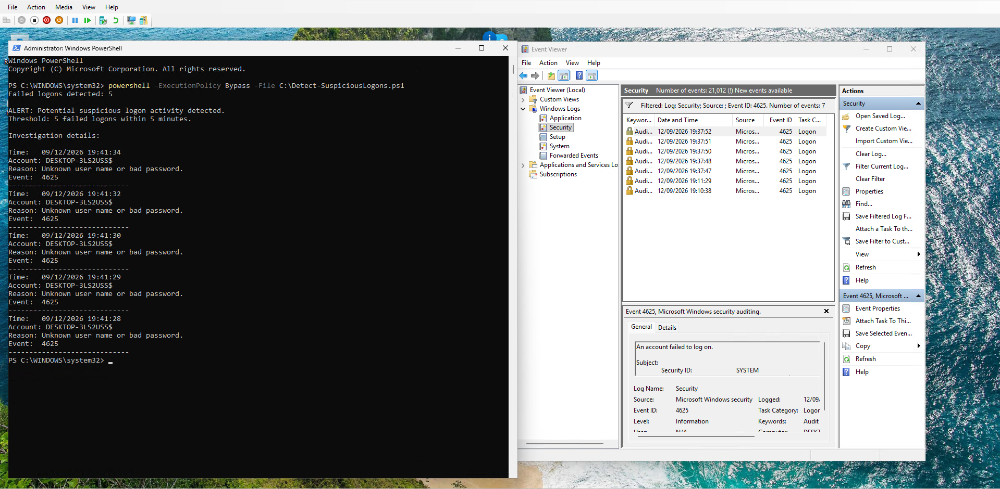

# Windows Suspicious Activity Detection Lab

A cybersecurity lab project focused on detecting and investigating suspicious authentication activity using Windows Security Event Logs and PowerShell.

## Overview

This project demonstrates a simple security monitoring workflow in a controlled Windows 11 virtual machine.

The lab was used to generate controlled failed logon activity, investigate Windows Security Event ID 4625, and develop a PowerShell-based detection script capable of identifying bursts of failed authentication attempts.

The project focuses on the investigation process rather than simulating a real-world attack.

## Objectives

- Build a controlled Windows security monitoring lab
- Generate controlled failed authentication events
- Investigate Windows Security Event ID 4625
- Query Windows event logs using PowerShell
- Develop threshold-based detection logic
- Investigate flagged events
- Document findings and limitations

## Lab Environment

- Windows 11 Pro
- Hyper-V virtual machine
- 8 GB RAM allocated to the VM
- 4 virtual CPUs
- Windows Security Event Logs
- PowerShell

## Detection Method

The detection script monitors Windows Security Event ID 4625, which represents a failed logon attempt.

The current rule triggers an alert when:

**5 or more failed logons occur within 5 minutes.**

This is a threshold-based detection rule designed to identify a potential suspicious authentication burst.

The rule does not automatically classify the activity as malicious.

## Investigation Process

### 1. Generate Authentication Events

Controlled incorrect-password attempts were performed within the Windows virtual machine.

These attempts generated Event ID 4625 entries in the Windows Security log.

### 2. Review Events

The Security log was filtered for Event ID 4625 using Windows Event Viewer.

### 3. Investigate Event Details

The event properties were examined to identify information such as:

- Target account
- Logon type
- Failure reason
- Calling process
- Source network address
- Authentication information

### 4. Query Logs with PowerShell

Windows Security events were queried programmatically using `Get-WinEvent`.

### 5. Detect Suspicious Activity

The PowerShell script checks for failed logons within a configurable time window.

When the threshold is exceeded, an alert is generated.

### 6. Investigate the Alert

The final version of the script provides timestamps, targeted account information, failure reasons and Event IDs for the detected events.

## Detection Script

The detection logic is contained in:

`Detect-SuspiciousLogons.ps1`

The script:

1. Retrieves Event ID 4625 events from the Security log.
2. Restricts results to the configured time window.
3. Counts the matching events.
4. Compares the count against the configured threshold.
5. Generates an alert when the threshold is exceeded.
6. Displays investigation details for the detected events.

## Findings

Five failed logon events were successfully detected within the configured five-minute window.

The events were associated with the local Windows environment and were generated as part of controlled testing in the lab.

Further investigation showed:

- Event ID: 4625
- Target account: Oliver
- Failure reason: Unknown user name or bad password
- Logon Type: 7
- Caller process: `svchost.exe`
- Source network address: `0.0.0.0`

The activity was therefore treated as controlled lab activity rather than a confirmed external attack.

## Limitations

The current detection rule is intentionally simple.

Potential limitations include:

- Legitimate users may generate multiple failed logons.
- A fixed threshold can produce false positives.
- The rule does not currently distinguish between different causes of failed authentication.
- The detection only examines Event ID 4625.
- There is no automated alerting or centralised log collection.

## Future Improvements

Possible improvements include:

- Add detection for additional Windows security events
- Improve account and logon-type filtering
- Add severity levels
- Export detections to structured CSV or JSON
- Build a larger Windows home lab
- Integrate logs with a SIEM such as Wazuh
- Develop additional detection rules
- Add automated monitoring

## Evidence

The screenshots included in this repository document the investigation and detection process.

The lab activity was performed in an isolated virtual environment for educational purposes.

## Disclaimer

This project was conducted in a controlled lab environment using systems owned or operated by the author.

The failed authentication activity was deliberately generated for testing and should not be interpreted as evidence of a real-world attack.
